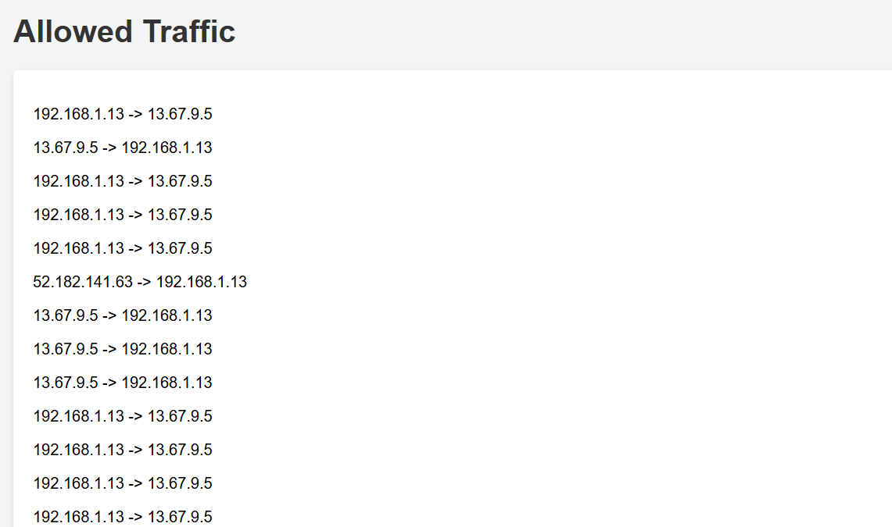

# Autonomous-Network-Defence-and-Monitor

This Flask app captures network traffic, detects anomalies, and prevents ARP spoofing attacks. It displays blocked traffic and open ports on a simple UI.

## Features
- Capture network traffic and detect anomalies
- Block suspicious traffic
- Detect and prevent ARP spoofing (MITM)
- Display open ports
- User-friendly interface for monitoring
## How to Run
1. Install dependencies:
   ```bash
   pip install -r requirements.txt
    ```
## Run the app:
```bash
python app.py
 ```
## Project Structure
```bash
Autonomous-Network-Defence-and-Monitor/
│
├── app.py                   # Main Flask application
├── packet_sniffer.py        # Module for packet sniffing, anomaly detection, and IP blocking
├── traffic_monitor.py       # Module for tracking and analyzing network traffic
├── static/
│   ├── css/
│   │   └── style.css        # Custom CSS for UI styling
│   └── js/
│       └── main.js          # JavaScript for fetching and displaying data
├── templates/
│   ├── index.html           # Frontend HTML for the main dashboard
│   ├── allowed_traffic.html # Frontend HTML for allowed traffic
│   ├── blocked_traffic.html # Frontend HTML for blocked traffic
│   └── open_ports.html      # Frontend HTML for open ports
└── requirements.txt         # Required libraries and dependencies

```


